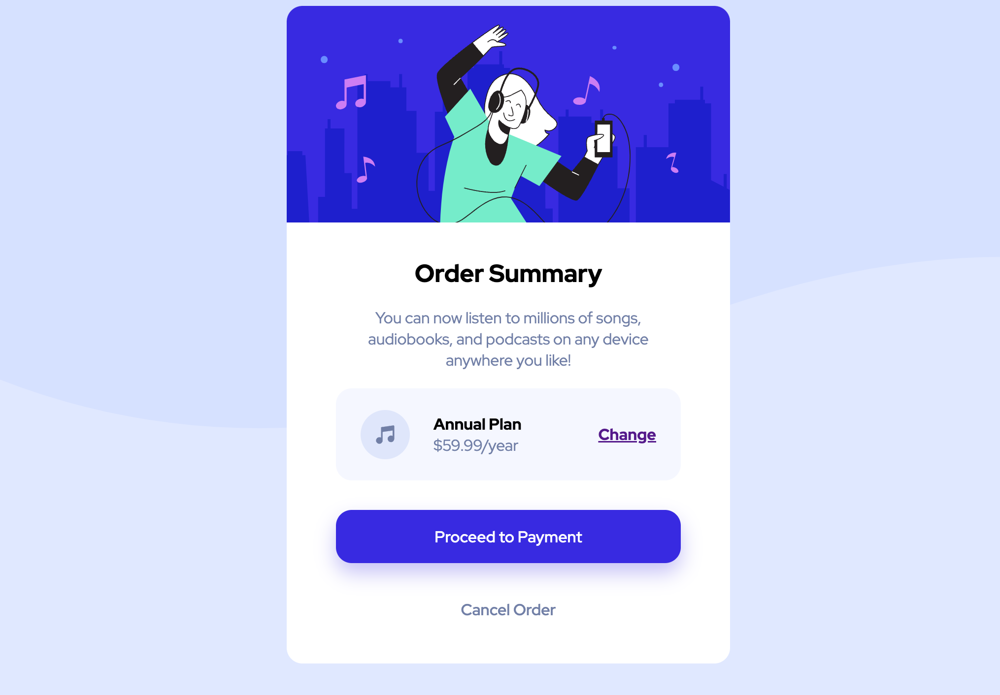

# Frontend Mentor - Order summary card solution

This is a solution to the [Order summary card challenge on Frontend Mentor](https://www.frontendmentor.io/challenges/order-summary-component-QlPmajDUj). Frontend Mentor challenges help you improve your coding skills by building realistic projects. 

## Table of contents

- [Overview](#overview)
  - [The challenge](#the-challenge)
  - [Screenshot](#screenshot)
  - [Links](#links)
- [My process](#my-process)
  - [Built with](#built-with)
  - [What I learned](#what-i-learned)
- [Author](#author)
- [Acknowledgments](#acknowledgments)

## Overview

### The challenge

Users should be able to:

- See hover states for interactive elements

### Screenshot


### Links

- Solution URL: [html](https://github.com/lukejans/order-summary-component/blob/main/index.html) & [css](https://github.com/lukejans/order-summary-component/blob/main/style.css)
- Live Site URL: [github pages]()

### What I learned

```css
@import url(https://fonts.googleapis.com/css?family=Red+Hat+Display:300,400,500,600,700,800,900);

body {
  font-family: 'Red Hat Display';
}
```
this was my first time importing fonts and also learned to import the various font weights to customize with css.

- all other work done was accomplished from previous knowledge 

## Author

<a href="https://www.frontendmentor.io/profile/lukejans">
    
  </a>
<a href="https://twitter.com/lukejanss">
    
  </a>
<a href="https://www.linkedin.com/in/luke-janssen-96592a245/">
    
  </a>
<a href="https://replit.com/@LukeJanssen1">
    
  </a> 